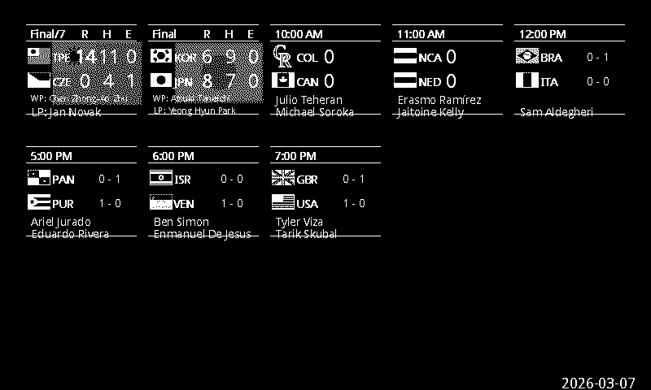
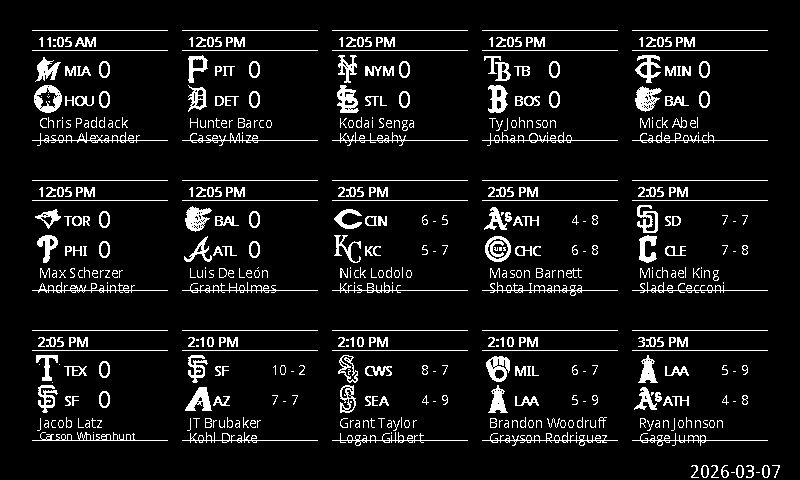

# MLB Game Tracker for E-Paper Display

Fetches and displays MLB game data on a 7.5-inch Waveshare e-paper display (800×480). Supports five display modes configured in `config/config.yaml`. Controllable via Discord bot.

## Display Modes

### Scoreboard Mode

Shows up to 15 games in a 5×3 grid. Each game tile adapts to the game state — pre-game shows start time, probable pitchers, and team records; in-progress shows score, base runners, outs, and ball/strike count (only once the first pitch is thrown); final shows R/H/E and winning/losing pitcher.



### Linescore Mode

Shows two detailed game scoreboards plus a live division standings table. Includes per-inning runs, R/H/E totals, base runners, win probability for live games, last play event, and venue.



### Field View

Single-game display showing a baseball field diagram with venue-specific outfield dimensions. The outfield fence is drawn as a multi-segment wall reflecting the actual LF/LCF/CF/RCF/RF distances for the ballpark being played in (all 30 MLB parks supported, with distance labels). All batted balls from the game are plotted on the field — the most recent hit shows as a filled circle with a crosshair, earlier hits as small open circles. Bases fill in solid when runners are on. A mini strike zone overlay in the upper-left shows pitches for the current at-bat (count label is hidden when the game is final). Right side shows score, inning/count/outs (hidden when final), batter/pitcher matchup (WP/LP/SV when final), last play, and a mini linescore.


### Scorecard View

Official scorer-style at-bat grid for both teams. Shows each batter's result per inning (K, BB, 1B, HR, etc.) with a mini base diamond indicating bases reached. Includes per-inning run totals and R/H/E.


### Pitch View

Full strike zone diagram with all pitches for the current at-bat plotted by location. Right side shows a scrollable pitch log with sequence number, pitch type, velocity, and result (strike/ball/foul/in-play).


---

## Configuration

Edit `config/config.yaml`:

```yaml
# Display mode: scoreboard | linescore | field | scorecard | pitch
display_mode: scoreboard

# Primary team for single-game modes (field/scorecard/pitch)
primary: NYY
primary_backup: BOS
primary_backup_2: NYM

# Refresh interval (minutes) between schedule API calls
update_interval: 14

# Live game data limits
max_live_game_calls: 15
fetch_last_play: false

# Timezone for game start times
timezone: America/Chicago

# Sport priority (first sport with regular-season games wins)
# MLB (1) filters out spring training; WBC (8) shows when MLB is off-season
sport_id_priority:
  - 1    # MLB regular season
  - 8    # World Baseball Classic
  - 16   # Spring Training
  - 51   # International
  - 11   # College Baseball
  - 14   # Winter Leagues

# Night mode: skip refreshes between night_start and night_end (24h)
night_mode: true
night_start: 2
night_end: 7

# Display appearance
dark_mode: true
use_team_logos: true
small_logo_x_offset: 2

# Discord bot (see Discord section below)
discord_token: ""
discord_guild_id: 0
discord_channel_id: 0
```

---

## Discord Bot

Control the display from a Discord channel using `!display` prefix commands.

```
!display mode scoreboard    — switch to 15-game scoreboard grid
!display mode field         — switch to single-game field view
!display mode scorecard     — switch to at-bat scorecard
!display mode pitch         — switch to pitch location view
!display mode linescore     — switch to linescore + standings

!display team NYY           — change the primary team
!display status             — show current mode and team
!display help               — show all commands
```

After each `!display` command the bot posts the current display image to the channel.

### Setup

1. Create a bot at [discord.com/developers](https://discord.com/developers/applications)
2. Enable **Message Content Intent** under Bot → Privileged Gateway Intents
3. Add the token to `config/config.yaml` under `discord_token`
4. Optionally set `discord_channel_id` to restrict commands to one channel
5. Run the bot alongside the display script:

```bash
poetry run python src/discord_bot.py &
```

The bot writes changes to `data/discord_state.json`. On the next cron run, the display script reads the pending change, shows a brief "Display Changing — requested by @username" announcement screen, then switches to the new mode.

---

## Team Logos

Team logos are displayed in each game tile when `use_team_logos: true` is set. Logos are fetched automatically from ESPN's CDN on first use, or downloaded in bulk:

```bash
# Download all MLB logos
poetry run python src/download_logos.py

# Download World Baseball Classic logos
poetry run python src/download_logos.py --wbc

# Download logos for any sport
poetry run python src/download_logos.py --sport-id 8 --fetch-teams
```

Logos are stored in `pic/logos/{ABBR}.png`. Falls back to the 3-letter abbreviation for any missing logo.

---

## Smart Polling

When no games are scheduled, the display skips MLB API calls entirely rather than polling every 14 minutes:

- After a day with no games, the script searches up to 30 days ahead for the next game date
- Stores the result in `data/schedule_state.json` and exits immediately on subsequent runs
- On game day with no game yet in progress, polls at most once per hour (for starting pitchers)
- Resumes normal per-`update_interval` polling once games start

---

## Installation

```bash
git clone <repo>
cd mlb_display
poetry install
```

Hardware: connect a Waveshare 7.5-inch V2 e-paper display to a Raspberry Pi, verify SPI is enabled.

On macOS the e-ink update is skipped automatically (development mode) — images are still generated as `resulting_image.bmp`.

---

## Usage

Run via cron or a systemd timer:

```bash
# Default (reads display_mode from config)
poetry run python src/scoreboard_generate.py

# Specific date or sport
poetry run python src/scoreboard_generate.py --date 2024-07-26
poetry run python src/scoreboard_generate.py --sport-id 8   # World Baseball Classic

# Linescore mode
poetry run python src/linescore.py

# Pre-populate team abbreviation cache (useful for non-MLB sports)
poetry run python src/scoreboard_generate.py --sport-id 8 --fetch-teams
```

Example crontab (every 5 minutes):
```
*/5 * * * * cd /home/pi/mlb_display && poetry run python src/scoreboard_generate.py >> logs/display.log 2>&1
```

---

## Project Structure

```
mlb_display/
├── src/
│   ├── scoreboard_generate.py  # Main entry point (all modes)
│   ├── linescore.py            # Linescore mode entry point
│   ├── generate_image.py       # Scoreboard image rendering
│   ├── field_view.py           # Field diagram renderer
│   ├── scorecard_view.py       # At-bat scorecard renderer
│   ├── pitch_view.py           # Pitch location renderer
│   ├── game_detail_fetch.py    # MLB live feed API fetcher
│   ├── discord_bot.py          # Discord control bot
│   ├── download_logos.py       # Bulk logo downloader (MLB + WBC)
│   ├── display_eink.py         # Waveshare e-ink driver wrapper
│   ├── refresh_tracker.py      # Full-refresh interval tracker
│   └── util.py                 # JSON/YAML helpers
├── config/
│   └── config.yaml
├── data/                       # Runtime cache (gitignored)
│   ├── games.json              # Cached game state
│   ├── teams.json              # Team abbreviation cache
│   ├── discord_state.json      # Pending Discord changes
│   └── schedule_state.json     # Next game date cache
└── pic/
    ├── Font.ttc
    ├── logo_render_config.json  # Per-team logo invert/darken settings
    └── logos/                   # Team logo PNGs (auto-downloaded)
```

---

## License

MIT License.
