# MLB E-Ink Display

Real-time MLB scoreboard for a **Waveshare 7.5″ V2 e-paper display** (800×480) running on a Raspberry Pi. Fetches live MLB data and renders it in multiple display modes. Controllable via Discord bot.

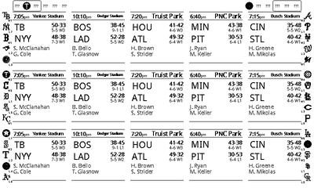

> Screenshots are auto-regenerated nightly and on every push to `main` that touches a rendering source file.

---

## Display Modes

Switch modes any time via `display_mode` in `config/config.yaml` or via the Discord bot. Valid modes: `scoreboard`, `field`, `scorecard`, `pitch`, `derby` (plus the legacy `linescore` two-game layout). The **idle screen** and **Home Run Derby** bracket appear automatically when conditions call for them — see below.

### Scoreboard — 5×3 grid (15 games)

The default mode. All 15 games fit on one screen, with a **division standings sidebar** along both edges and a **wildcard standings strip** across the top showing team logos ordered by games back.

Each tile adapts to game state — see [Tile States](#scoreboard-tile-states) below.

**Pre-game** — shows start time, stadium, probable pitchers with season stats, team records, current streak, Vegas moneyline, and a weather forecast (temp, wind, precip source).

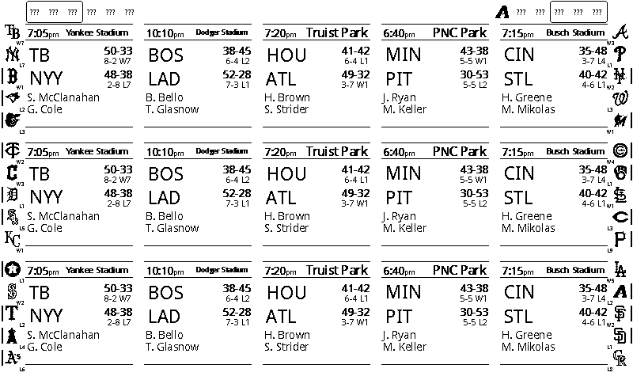

**Live** — two sub-states depending on whether a pitch is in flight or the half-inning has just ended:

- *Mid-inning:* shows score, inning/half indicator, **base runner diamonds**, **outs**, **ball/strike count**, per-inning linescore, and a **win probability bar** with team logos. Live detail line shows current pitcher, batter, fastball %, and pitch count.
- *Between innings:* bases, outs, and count are hidden — replaced by the **next three batters** due up and the incoming pitcher. Per-inning linescore and win probability bar remain.

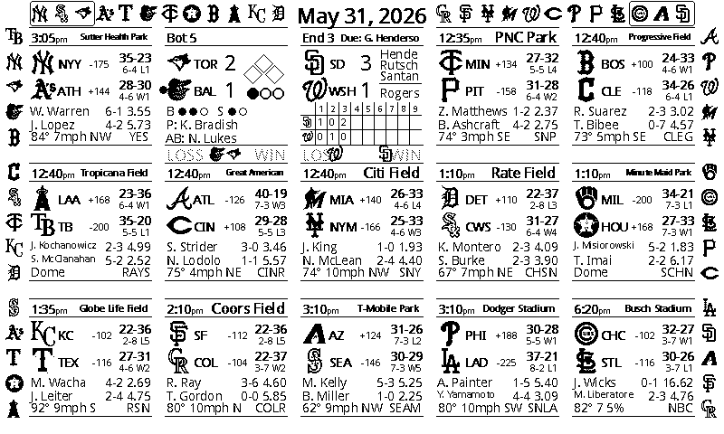

**Finals** — shows R/H/E, winning/losing pitcher (with record), save, and the winning team's logo as a large ghost watermark behind the score.

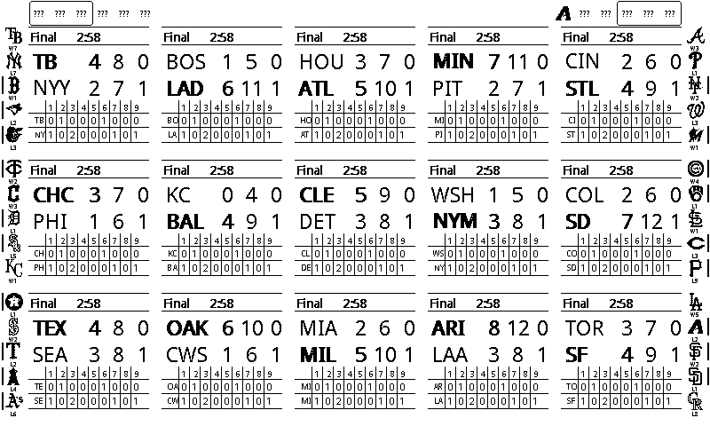

**No-hitter / perfect game** — when a pitcher carries a no-hitter into the 6th inning, the game tile's header inverts (white-on-black banner) as a visual alert. The inversion applies to the regular tile, the wide featured cell, and the fullscreen view.

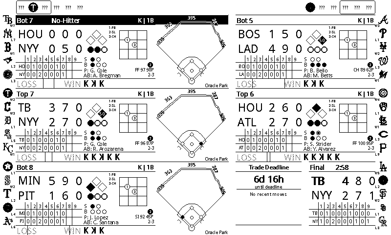

---

### Wide Cell (Featured Game)

When your primary team is playing, the scoreboard grid can slot their game into a **2-cell wide tile** (285×130 px) that adds a full right panel alongside the standard left panel.

The right panel shows:
- **Pitch zone** with the current at-bat's pitches plotted
- **Ball/strike/out count** with visual indicators
- **K strip** tracking each pitcher's strikeout sequence
- **Pitcher / batter rows** with last pitch type and speed

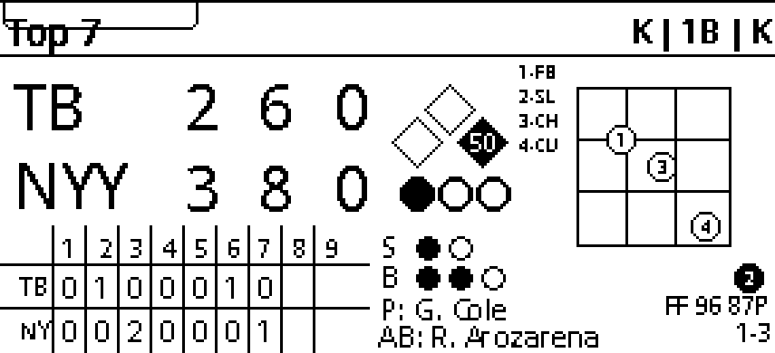

Wide-cell behavior is configurable:

- `wide_cell_always` — always show a wide cell for the in-progress game farthest along, even with a full 15-game slate (one game is dropped to make room).
- `wide_cell_featured` — reserve the wide cell for the primary team's game while it's live, falling back to the farthest-along game otherwise.
- `triple_cell_live` — expand the featured live game to a **3-cell (435 px) tile**: score/linescore, pitch zone/situation, and a third cell with the venue outfield wall, infield diamond, and live runner positions. Falls back to a 2-cell tile when a 3-unit tile can't fit the column.
- `hide_non_live_games` — when at least one game is live, drop finished and not-yet-started games from the grid so live games can expand into wide/triple tiles (up to 3 live games get triple tiles). The pinned favorite game is never hidden.

---

### Standings Sidebar

Both outer edges of the scoreboard display division standings. AL divisions run down the left edge; NL divisions run down the right. Each team logo (or 3-letter abbreviation when no logo is cached) shows:

- A **streak badge** (`W7`, `L3`, etc.) centered below the logo
- A **movement indicator** — a short line on the outer edge when a team changed rank in the last 20 hours
- A **clinch box** around the slot when a team has clinched a playoff spot or division

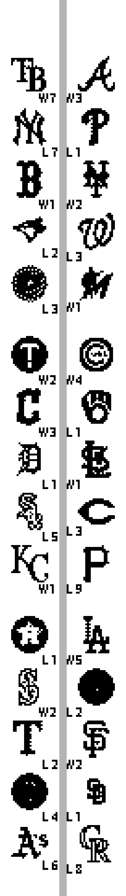

---

### Top Header Strip

The strip across the top of the scoreboard shows one of three things, in priority order:

- **Overflow ticker** — whenever a live game's wide/triple tile (or a >15-game slate) bumps other games off the 5×3 grid, the bumped games are shown as a compact "Away v Home &lt;status&gt;" strip instead of just disappearing: start time if the game hasn't started, inning (e.g. `Top 4`) if live, `Final`, or `Postponed`. Games still worth watching are kept on the grid — already-finished games are bumped first. Rotates through a batch of them every `overflow_ticker_rotation_minutes` (default 2) if more are bumped than fit at once. Takes over the strip outright whenever any games are bumped.
- **Postseason bracket** (`show_playoff_bracket`) — during the postseason window (mid-September to mid-November), once real bracket data exists, the strip switches to a series-win bracket fetched from the MLB schedule API.
- **Wildcard standings** (`show_wildcard_standings`) — the fallback the rest of the year: AL top-10 left-to-right on the left half, NL right-to-left on the right half; rank 1 at the outer edge, converging toward center, with abbreviation and games back per slot.

---

### Empty-Cell Panels

When the slate has fewer than 15 games, the spare grid cells are filled with informational panels instead of being left blank. In priority order:

- **Trade deadline countdown** (`show_deadline_panel`) — countdown to `trade_deadline` plus recent transactions; only appears in the two weeks before the deadline.
- **Transactions ticker** (`show_transactions_ticker`) — recent MLB transactions (IL moves, call-ups/demotions, signings).
- **Batting lineup panel** (`show_lineup_panel`) — both teams' batting orders, shown within 45 minutes of the primary team's first pitch.
- **News headlines** (`show_news_panel`) — recent MLB news, optionally scoped to the primary team (`news_team_only`).
- **Magic / elimination numbers** (`show_magic_numbers`) — the primary team's division standings. The leader's row always shows its magic number (`M12`); trailing teams show games back until their elimination number drops below 20, at which point that row switches to the elimination number (`E7`) instead. A miniature version of the same M12/E7 badge (`sidebar_magic_badges`) can also be shown next to each team's logo in the standings sidebar.
- **Hot Hitters / Hot Arms** (`show_streaks_panel` / `show_scoreless_panel`) — 14-day rolling batting average and ERA leaders.
- **Season leaders panel** (`show_leaders_panel`) — cycles through HR / AVG / ERA / Saves / Hits / RBI / SB, rotating category every `leaders_rotation_minutes` (default 5) and refreshed once a day.
- **Config QR code** (`show_config_qr`) — a QR code linking straight to the [config web server](#config-web-server).

---

### Idle Screen

When there are no games at all for the day (e.g. the All-Star break or a deep off-season day), the display shows an idle **"Recent Moves"** screen: two columns of recent MLB transactions with a team **mascot** image bouncing across the screen as an overlay. Mascots are fetched by `src/download_mascots.py`.

---

### Home Run Derby

On the Derby's date, when there are no regular games to show, the display auto-switches to a single-elimination **Home Run Derby bracket** (8 batters) — see `auto_derby_mode`. Setting `display_mode: derby` forces it on unconditionally. Bracket data lives in `data/derby_bracket.json`; once the event goes live the run polls MLB every 60 seconds until it ends (capped at 3 hours).

---

### Fullscreen Featured Game

Single-game focus mode for your primary team. Enable by setting `FEATURED_TEAM_FULLSCREEN=true` in the environment.

- **Live:** custom 800×480 layout with large inning header, R/H/E columns, base-runner diagram, outs, and the same between-innings next-batters panel as the tile view.
- **Pre-game / Final:** the normal scoreboard tile scaled up 3× and centered, with wildcard strip and standings sidebars drawn around it exactly as they appear in the grid.

---

### Field View

Single-game display with a venue-accurate outfield diagram. All 30 MLB parks are supported — the fence is drawn as a multi-segment wall with LF/LCF/CF/RCF/RF distance labels. Every batted ball is plotted on the field (most recent: filled circle with crosshair; earlier hits: open circles). A mini strike zone overlay shows pitches for the current at-bat. The right panel shows score, inning, count, outs, batter/pitcher matchup, last play text, and a mini per-inning linescore.

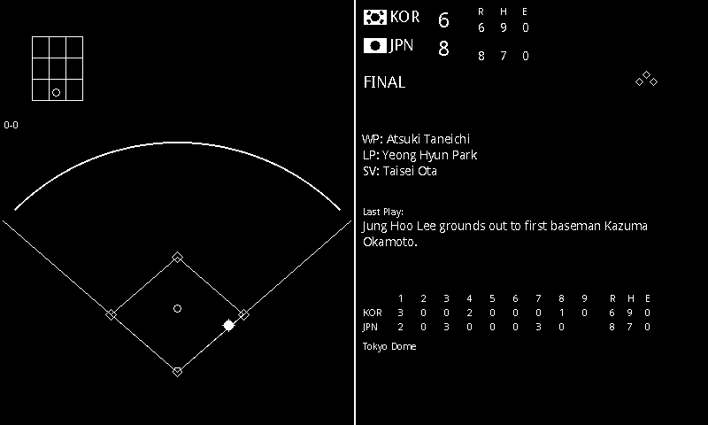

---

### Scorecard View

Official scorer–style at-bat grid for both teams. Each cell shows the batter's result per inning (K, BB, 1B, 2B, HR, GO, FO, etc.) with a mini base diamond indicating bases reached. Per-inning run totals and R/H/E summary at the right.

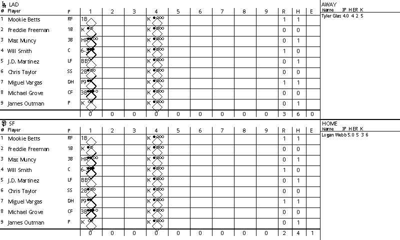

---

### Pitch View

Full 3×3 strike zone diagram with all pitches for the current at-bat plotted by location. Pitch types are visually differentiated (strike/ball/foul/in-play). The right panel shows the batter/pitcher matchup, season stats, and a scrollable pitch-by-pitch log with pitch type, velocity, and result.

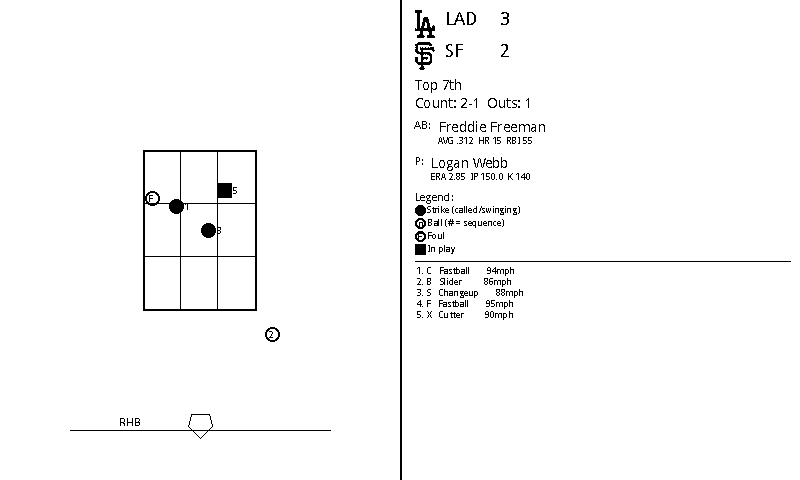

---

## Scoreboard Tile States

Every tile in the 5×3 grid is self-contained and adapts to real-time game state.

### Pre-Game

Shows start time, stadium, **probable pitchers** with W-L and ERA, **team records** with current win/loss streak, **Vegas moneyline** odds, and a **weather forecast** for first pitch (temp, wind speed/direction, precipitation source).

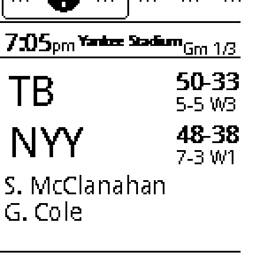

### Live / In Progress

The tile has two distinct layouts depending on inning state.

**Mid-inning (pitch in play):** score, inning/half indicator (e.g. `TOP 6`), **base runner diamonds** (open = empty, filled = occupied), **outs** as filled circles, **ball/strike count**, and a rolling per-inning linescore grid. Live detail line shows current pitcher, batter, fastball %, and pitch count. A **win probability bar** anchors the bottom with each team's logo at their live win chance.

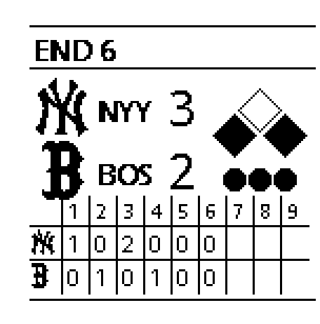

**Between innings:** bases, outs, and count are cleared — the tile shows the **next three batters** due up for the upcoming half-inning (leadoff, on-deck, in-hole) and the incoming pitcher below a separator line. Per-inning linescore and win probability bar remain.

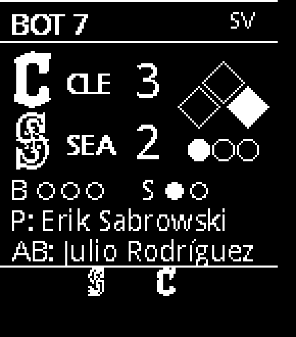

### Final

Shows R/H/E, **winning/losing pitcher** with record, and save. The winning team's logo renders as a large semi-transparent **ghost watermark** centered behind the score.

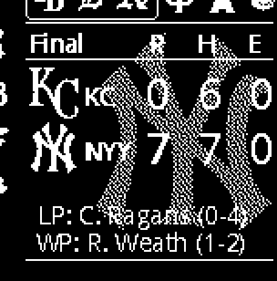

---

## Feature Highlights

| Feature | Detail |
|---|---|
| **Overflow ticker** | Header strip shows games bumped off the grid — already-finished games are bumped first |
| **Wildcard strip** | Top row of team logos, AL left → NL right, ordered by games back |
| **Playoff bracket** | Header strip auto-switches to a series-win bracket during the postseason |
| **Standings sidebar** | AL East/Central/West on left edge, NL on right — 1st through 5th |
| **Streak badge** | `W7` / `L3` displayed below each team's logo in the standings sidebar |
| **Movement indicator** | Line on sidebar outer edge when a team changed rank in the last 20 hours |
| **Wide / triple cell** | Featured game gets a 2- or 3-slot tile with pitch zone, K strip, BSO, and outfield wall |
| **Hide non-live** | Drop finished/upcoming games so live games expand into wide/triple tiles |
| **No-hitter alert** | Header inverts (white-on-black) when a no-hitter or perfect game is active ≥ 6th inning |
| **Win probability** | Live bar with logos at their real-time win % position |
| **Live details** | Pitcher, current batter, fastball %, pitch count, last pitch speed |
| **Leaders panel** | HR / AVG / ERA / Saves / Hits / RBI / SB leaders in a spare cell, rotating |
| **Transactions ticker** | Recent IL moves, call-ups, and signings in a spare cell |
| **Magic / elimination numbers** | Leader shows magic number; trailing teams show games back, switching to elimination number under 20 |
| **Idle screen** | "Recent Moves" + bouncing mascot when there are no games today |
| **Derby bracket** | Auto Home Run Derby single-elimination bracket on Derby day |
| **Team logos** | Auto-fetched from ESPN CDN; per-team invert/darken config |
| **Ghost logo** | Winning team logo as watermark on Final tiles |
| **Weather** | Open-Meteo (no key needed) with stadium GPS coordinates |
| **Vegas odds** | Moneyline displayed on pre-game tiles |
| **Smart polling** | Skips API on off-days; finds next game date up to 30 days ahead |
| **Night mode** | Suppresses refreshes during configurable overnight window |
| **Morning mode** | Alternates yesterday finals ↔ today schedule until `morning_end` (separate weekday/weekend cutoffs) |
| **Auto dark mode** | White-on-black between `dark_start` and `dark_end`; full refresh forced on the transition |
| **Auto timelapse** | Generates `.gif` + `.mp4` after all games go Final |
| **Discord bot** | Switch mode or team from a Discord channel; bot posts preview image |
| **MLB / MiLB / WBC** | `league_mode` (`mlb`/`aaa`) plus a sport priority list — WBC, Spring Training, International, Triple-A |
| **Config QR** | QR to the mobile config server shown in a spare cell |
| **Debug overlay** | Uptime + last successful fetch time in the corner (`show_debug_overlay`) |
| **Partial refresh** | Changed regions refreshed without full-screen flash |

---

## Configuration

Edit `config/config.yaml`:

```yaml
# ── Display mode ──────────────────────────────────────────────
# scoreboard | linescore | field | scorecard | pitch | derby
display_mode: scoreboard
auto_derby_mode: true        # auto-show the Derby bracket on Derby day when no games

# ── Primary team (for single-game modes and favorite-first slot) ──
primary: NYY
primary_backup: BOS
primary_backup_2: NYM
favorite_team_first: true    # pin primary team to top-left slot

# ── Refresh ───────────────────────────────────────────────────
update_interval: 14          # minutes between schedule API calls
live_game_interval: 0        # 0 = use update_interval during live games
max_live_game_calls: 15      # max live-feed calls per game per run

# ── Timezone ──────────────────────────────────────────────────
timezone: America/Chicago

# ── League / sport priority (first sport with games wins) ─────
league_mode: mlb             # "mlb" (AL/NL) or "aaa" (Triple-A, IL/PCL)
sport_id_priority:           # only used when league_mode is "mlb"
  - 1    # MLB
  - 8    # World Baseball Classic
  - 16   # Spring Training
  - 51   # International
  - 11   # Triple-A

# ── Night / morning modes ─────────────────────────────────────
night_mode: true
night_start: 2               # hour (24h) to stop refreshing
night_end: 7                 # hour (24h) to resume
morning_alternate_games: true
morning_end: 9               # weekday hour when "yesterday" gives way to today
morning_end_weekend: 11      # weekend cutoff

# ── Auto dark mode ────────────────────────────────────────────
dark_start: 20               # 8pm — display goes white-on-black
dark_end: 7                  # 7am — display returns to light
use_team_logos: true
small_logo_x_offset: 2

# ── Scoreboard extras ─────────────────────────────────────────
show_wildcard_standings: true
show_standings_sidebar: true
show_playoff_bracket: true    # header auto-switches to bracket in postseason
scoreboard_win_probability: true
scoreboard_live_details: true
final_linescore_minutes: 60   # minutes to keep linescore visible after Final
hide_non_live_games: true     # drop finished/upcoming games so live games expand
wide_cell_always: false       # always show a wide cell for the farthest-along game
wide_cell_featured: false     # reserve the wide cell for the primary team's live game
triple_cell_live: false       # expand featured live game to a 3-cell tile

# ── Empty-cell panels (shown when < 15 games) ─────────────────
show_transactions_ticker: false
transactions_lookback_days: 2
show_leaders_panel: true
leaders_rotation_minutes: 5
show_config_qr: false         # QR to the config web server in a spare cell
config_server_port: 8080      # port for `python src/config_server.py`
show_debug_overlay: true      # uptime + last fetch time in the corner

# ── Weather ───────────────────────────────────────────────────
weather:
  enabled: true
  cache_ttl_minutes: 60

# ── Timelapse ─────────────────────────────────────────────────
auto_generate_video: false
video_interval_min: 5
video_frame_delay_ms: 300
```

---

## Installation

```bash
git clone <repo>
cd mlb_display
poetry install

# Download team logos (MLB + WBC)
poetry run python src/download_logos.py
poetry run python src/download_logos.py --wbc

# Download mascot images (for the idle "Recent Moves" screen)
poetry run python src/download_mascots.py

# Seed standings cache before enabling show_standings_sidebar
poetry run python src/standings.py
```

**Hardware:** Waveshare 7.5″ V2 e-paper display connected to a Raspberry Pi with SPI enabled.

**macOS / dev mode:** e-ink hardware update is skipped automatically; images are saved to `resulting_image.bmp` for local preview.

---

## Usage

```bash
# Single run (reads display_mode from config)
poetry run python main.py --local        # macOS / no hardware
poetry run python main.py                # Raspberry Pi

# Specific date or sport
poetry run python main.py --date 2026-04-19
poetry run python main.py --sport-id 8   # World Baseball Classic

# Fullscreen featured game (primary team, single-game focus)
FEATURED_TEAM_FULLSCREEN=true poetry run python main.py
```

**Crontab** — run every 14 minutes:

```cron
*/14 * * * * cd /home/pi/mlb_display && poetry run python main.py >> logs/display.log 2>&1
```

On the Home Run Derby's actual date, if there are no games to show, main.py automatically
switches to the Derby bracket (see `auto_derby_mode` in config.yaml) instead of exiting quietly.
Once the event goes live, that run blocks and polls MLB every 60 seconds until the derby ends
(capped at 3 hours) rather than waiting for the next 14-minute cron tick — so a concurrent cron
invocation firing mid-derby is expected and harmless (it just re-fetches/re-renders the same data).

**systemd** — recommended for auto-start on boot:

```ini
[Unit]
Description=MLB E-Ink Display
After=network-online.target

[Service]
Type=simple
WorkingDirectory=/home/pi/mlb_display
ExecStart=/home/pi/.local/bin/poetry run python main.py
Restart=always
RestartSec=60

[Install]
WantedBy=multi-user.target
```

---

## Config Web Server

A mobile-first local web page for changing the most commonly-tweaked
settings (primary team, display mode, dark mode, logos, standings/wildcard
strips, wide-cell behavior, league mode, `.env`'s `FEATURED_TEAM_FULLSCREEN`
and `LEAGUE_MODE` override) without SSHing in to hand-edit YAML. Writes go
through a line-based patcher that only touches the specific value on a
key's line, so every comment in `config/config.yaml` is preserved.

Not a full config editor — it's deliberately scoped to the handful of
settings worth changing from a phone. No authentication; it trusts the
local network.

```bash
poetry run python src/config_server.py                # binds 0.0.0.0:8080 (config_server_port)
poetry run python src/config_server.py --port 9000     # override the port for one run
```

Open `http://<this-machine's-LAN-IP>:8080/` from any phone/laptop on the
same Wi-Fi. Changes apply on the next scoreboard refresh cycle — no restart
needed. When the scoreboard grid has a spare cell (fewer than 15 games), a
QR code pointing straight at this URL is shown there automatically (toggle
via `show_config_qr` in `config/config.yaml`).

**systemd** — run alongside (not instead of) the cron-triggered display
pipeline, so it's always reachable:

```ini
[Unit]
Description=MLB Display Config Server
After=network-online.target

[Service]
Type=simple
WorkingDirectory=/home/pi/mlb_display
ExecStart=/home/pi/.local/bin/poetry run python src/config_server.py
Restart=always
RestartSec=10

[Install]
WantedBy=multi-user.target
```

---

## Project Structure

```
mlb_display/
├── main.py                       # Pipeline orchestrator: fetch → render → display
├── config/
│   └── config.yaml               # All settings
├── src/
│   ├── fetch_games.py            # MLB Stats API fetcher → data/games.json
│   ├── render_scoreboard.py      # Render image from cached data (CLI)
│   ├── generate_image.py         # Core rendering logic (orchestrate_score_board)
│   ├── image_box.py              # Per-tile drawing (draw_box)
│   ├── image_featured.py         # Fullscreen featured-game renderer (draw_featured_game_fullscreen)
│   ├── image_standings.py        # Standings sidebar + wildcard strip
│   ├── field_view.py             # Field diagram renderer
│   ├── scorecard_view.py         # At-bat scorecard renderer
│   ├── pitch_view.py             # Pitch location renderer
│   ├── image_derby.py            # Home Run Derby bracket renderer
│   ├── image_idle.py             # Idle "Recent Moves" screen + bouncing mascot
│   ├── image_leaders.py          # Season-leaders panel cell
│   ├── image_transactions.py     # Transactions ticker cell
│   ├── image_standings.py        # Standings sidebar + wildcard / playoff strip
│   ├── fetch_derby.py            # Derby bracket fetcher → data/derby_bracket.json
│   ├── fetch_leaders.py          # Season-leaders fetcher (MLB Stats API)
│   ├── fetch_idle.py             # Historical game fetcher for the idle screen
│   ├── game_detail_fetch.py      # MLB live feed API (pitch-by-pitch)
│   ├── standings.py              # Standings + transactions fetcher + cache
│   ├── weather.py                # Open-Meteo forecast fetcher
│   ├── timelapse.py              # End-of-day .gif / .mp4 generator
│   ├── config_server.py          # Mobile-first config web server
│   ├── download_logos.py         # Bulk logo downloader (MLB + WBC)
│   ├── download_mascots.py       # Mascot image downloader (idle screen)
│   ├── display_eink.py           # Waveshare driver wrapper (macOS-safe)
│   ├── display.py                # CLI wrapper for display_eink
│   ├── refresh_tracker.py        # Full-refresh interval tracker (burn-in prevention)
│   ├── config_loader.py          # load_config() — canonical config loader
│   └── util.py                   # JSON/YAML helpers, repo-root-relative paths
├── templates/
│   └── config_server.html        # Mobile-first form for config_server.py
├── data/                         # Runtime cache (gitignored)
│   ├── games.json                # Cached game state from last fetch
│   ├── teams.json                # Team abbreviation cache
│   ├── standings.json            # Standings cache (refreshed on Final)
│   ├── derby_bracket.json        # Home Run Derby bracket state
│   └── schedule_state.json       # Next game date (smart polling)
├── docs/                         # README screenshots
├── pic/
│   ├── Font.ttc                  # Display font
│   ├── logo_render_config.json   # Per-team logo invert/darken settings
│   ├── logos/                    # Team logo PNGs (auto-downloaded)
│   └── mascots/                  # Team mascot PNGs (auto-downloaded)
└── output/                       # Generated images and timelapses
```

---

## License

MIT
